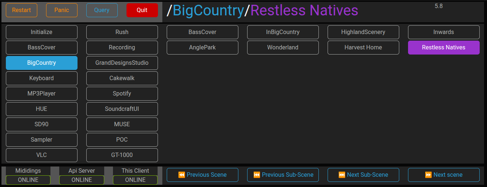

# stagedings

### **stagedings** is a modern API to navigate scenes and subscenes that has been configured in your [mididings](https://github.com/mididings/mididings) script.

---
> 🗒️ **Why stagedings?**  
> * stagedings requires a **mididings scene patch dictionary** defined in the `run` section of your mididings script to work correctly.  
> See the mididings documentation on the [`run` section here](https://mididings.github.io/mididings/main.html#mididings.run) for how to structure your patch.
> * stagedings is designed to replace the **`livedings UI`**, which was based on Tkinter.
> * stagedings offers a modern, web-based interface with enhanced flexibility and real-time control capabilities.

## 📸 UI Preview
A responsive, real-time interface for scene/subscene navigation in mididings.

---
## 🚀 Features
- Web UI with real-time scene/subscene updates
- FastAPI backend with full REST and WebSocket support
- Multiple clients supported
- Use the mididings OSC interface
- It exposes a **fully compliant OpenAPI spec** for easy generation of SDK clients in any language, enabling flexible remote control of mididings.

---

### The UI interface allow
* Direct navigation through scenes and subscenes
* Exposes the Restart, Panic, Query and Quit commands

### The REST API expose
* Endpoints for direct navigation through scenes and subscenes
* Endpoints to the Restart, Panic, Query and Quit commands

---

## Installation & dependencies
#### On the server running mididings
* apt-get install liblo-dev
* Clone this repository
* In the stagedings/src directory
  * Create a .env file
    * Add the key STAGEDINGS_WS_HOST with the server name and the port of your choice:
      * STAGEDINGS_WS_HOST=localhost:5000

#### In a Python Virtual Environment
* mididings community >= 20250818 with OSC support 
  * See the mididings README for build instructions
* pip install fastapi
* pip install jinja2
* pip install uvicorn\[standard\]
---
# ▶️Running the application

* In the stagedings/src directory
  
  * uvicorn main:app --port 5000 --host 0.0.0.0

* Then navigate to http://localhost:5000
  
  * / for the menu
  * /ui for the frontend
  * /docs or /redoc for API documentation

### 💬 Feedback & Contributions

We welcome bug reports, feature ideas, and contributions! Please open an issue or discussion.

### 📜 License

All files in this repository are released under the terms of the GNU
General Public License as published by the Free Software Foundation;
either version 2 or later of the License.
